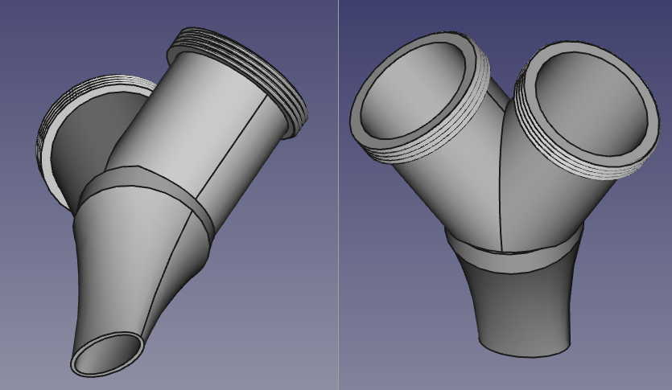

Relatively simple FreeCAD file using Part Design and the Thread Profile workbench v1.69.

Problem: changing parameter `minor_diameter` doesn't change size of external threads.

Basically modeling an air plenum divided into two pipes with threads on the end of each pipe. This is designed to be able to enable a person to qualitatively test the air resistance of different types of filter materials.

FreeCAD file: [ypipe-p40.FCStd](./ypipe-p40.FCStd)

Two views of what the modeled object looks like:



Am using a spreadsheet to store store the thread minor diameter for the five different size ypipe-plenums. Cell F3 has an alias: `minor_diameter` that selects the size to render.


The actual size of the extruded external threads minor diameter is stuck at the value for `p45`: `51.5 mm` even though inspecting the `VThreadProfile` object displays the value provided by the `minor_diameter` alias.

Here's an example of the alias correctly returning the value 61.5 mm in the VThreadProfile attribute but the modeled and rendered thread minor diameter hasn't changed.


Looking a bit earlier in the object tree the right side plenum is now rendering the correct radius and the threads are visibly too small:


It's not clear to me why the minor diameter for the threads is stuck ... and why later in theobject tree tthe diameter of both plenums  have reduced in size.

Am Using FreeCAD: 0.19.24276

```
OS: macOS 10.16
Word size of OS: 64-bit
Word size of FreeCAD: 64-bit
Version: 0.19.24276 (Git)
Build type: Release
Branch: (HEAD detached at 0.19.1)
Hash: a88db11e0a908f6e38f92bfc5187b13ebe470438
Python version: 3.8.8
Qt version: 5.12.9
Coin version: 4.0.0
OCC version: 7.4.0
Locale: C/Default (C)
```
